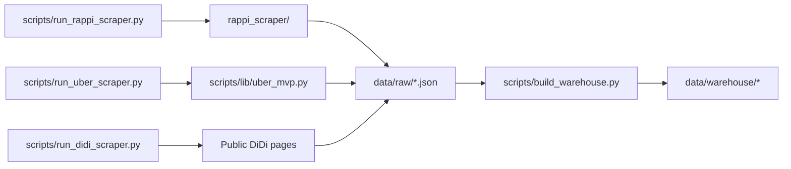

# Architecture

This repo now keeps only the active raw-collection path plus the docs needed
for the next warehouse step.

1. Each production script runs one platform-specific collection flow.
2. Each script writes a raw JSON artifact under `data/raw/`.
3. The next step is a warehouse builder that normalizes those artifacts into one
   analytical model.

## Design Notes

- **Raw contract first**: the practical source of truth is the shape already
  emitted into `data/raw/*.json`.
- **Platform-specific collection**: each scraper keeps the logic closest to the
  source it actually talks to.
- **Warehouse next**: normalization and analytics should now be built from the
  real raw artifacts, not from removed scaffold code.
- **Operational safety**: rate limiting, retries, and explicit legal/ethical constraints are first-class.
